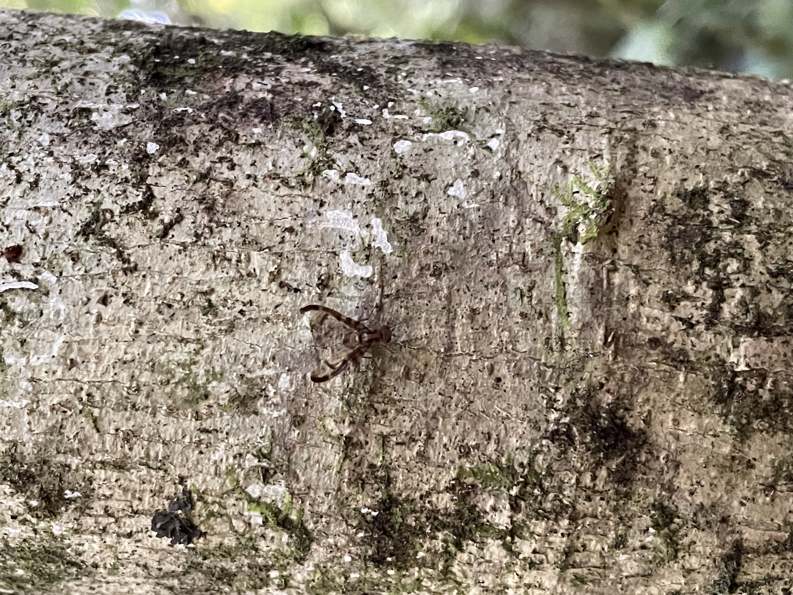
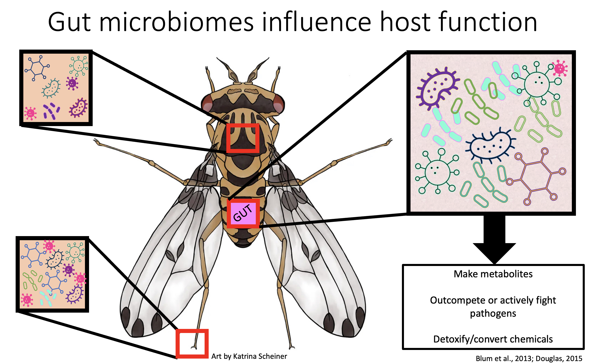
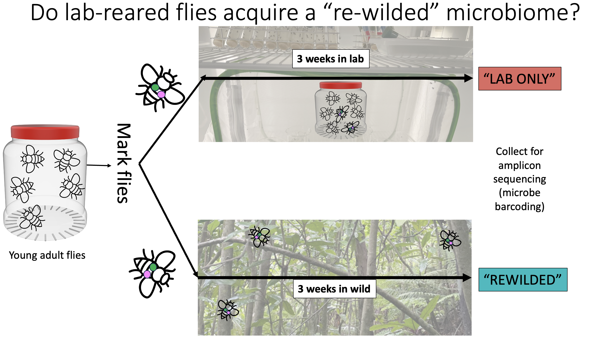
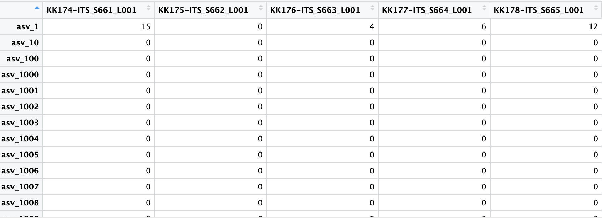
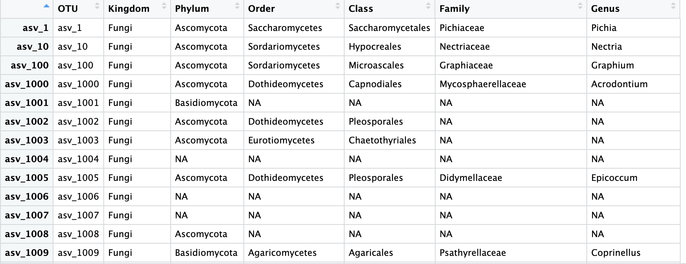
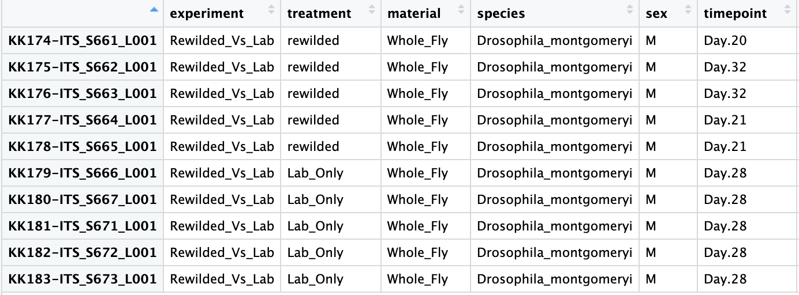

```{r setup, include=FALSE}
options(htmltools.dir.version = FALSE)
```


---
class: center, middle

# Hawaiian picture-wing flies

.pull-left[] 
.pull-right[]


---
class: center, middle

# Picture-wings in the lab and the wild
.pull-left[]
.pull-right[]

---
class: center, middle




---
class: center, middle

---
class: center, middle
# Let's analyze microbiome data 
## Load Libraries
```{r libraries, message=FALSE}
library(phyloseq)
library(here)
library(BiocManager)
library(tidyverse)
library(microbiome)
library(scales)
library(data.table)
library(patchwork)
library(janitor)
```

---
class: center, middle
# Data sets you need for microbiome analysis
## 1. Operational Taxonomic Unit (OTU)  matrix

.pull-center[]

---
class: center, middle
# Data sets you need for microbiome analysis
## 2. Taxonomy assigned to OTU numbers

.pull-center[]

---
class:middle, center
# Data sets you need for microbiome analysis
## 3. Metadata
.pull-center[]

---

# Upload ITS (Fungal Amplicon) Data into a Phyloseq Object 

```{r data}
ps <- read_mothur2phyloseq((here("data","abundance_table-lulu-100.shared")),here("data", "taxonomy_100.taxonomy"), mapping.file = (here("data","ITS_meta.csv"))) #upload the three files needed

ps_rewild <- subset_samples(ps, species == "Drosophila_montgomeryi")

# Extract individual files to double-check things worked

OTU = as(otu_table(ps_rewild), "matrix") # OTU table extract (rows are asvs)

taxonomy <- data.frame(tax_table(ps_rewild)) #tax table extract 

metadata <- data.frame(sample_data(ps_rewild)) #metadata extract
```

---
class:middle, center
# Sequencing depth histogram- how did my samples sequence?

```{r depth, fig.path = "../output/"}
depth <- metadata %>%
  mutate(TotalReads = sample_sums(ps_rewild), keep.rownames = TRUE) %>%
  ggplot(aes(TotalReads, fill = treatment)) +
  geom_histogram(bins = 30) +
  scale_x_continuous(breaks=seq(0,25000,1500)) +
  scale_y_continuous(breaks=seq(0,2,1)) +
  theme(axis.text.x.bottom = element_text(size = 10, angle = 60, hjust = .7, vjust = .7),
    panel.border = element_rect(colour = "black", fill = NA, linetype = 1),
    # color background 2)
    panel.background = element_rect(fill = "white"),
    # modify grid 3)
    panel.grid.major.x = element_line(colour = "black", linetype = 1, size = 0.5),
    panel.grid.minor.x = element_blank(),
    panel.grid.major.y =  element_line(colour = "black", linetype = 1, size = 0.5),
    panel.grid.minor.y = element_blank(),
    # modify text, axis and colour 4) and 5)
    axis.text = element_text(colour = "black"),
    axis.title = element_text(colour = "black"),
    axis.ticks = element_line(colour = "black"),
    # legend at the bottom 6)
    legend.position = "bottom") +
  scale_fill_discrete(labels=c('Lab Reared Flies', 'Rewilded Flies')) +
  labs(title = "Sequencing Depth",
       x = "Number of reads per sample",
       y = "Samples with x number of reads",
       fill = "Sample Type") 
depth
```
---

## Sequencing depth histogram- how did my samples sequence?
.pull-center[
```{r fig1, fig.height=6, fig.width=6 }
depth
```
]

---
# Beta Diversity using PCoA ordination
```{r beta1,fig.path = "../output/"}
dist = phyloseq::distance(ps_rewild, method="bray", binary = TRUE) #Measure dissimilarity between samples
ordination = ordinate(ps_rewild, method="PCoA", distance=dist) # ordinate those dissimilarity measurements onto a Principle Coordinate Analysis Plot
beta <- plot_ordination(ps_rewild, ordination, color ="treatment") + #plot_ordination starts the plot
  theme_classic() +
  theme(panel.border = element_rect(colour = "black", fill = NA, linetype = 1),
    # color background 2)
    panel.background = element_rect(fill = "white"),
    # modify grid 3)
    panel.grid.minor.x = element_blank(),
    panel.grid.minor.y = element_blank(),
    # modify text, axis and colour 4) and 5)
    axis.text = element_text(colour = "black"),
    axis.title = element_text(colour = "black"),
    axis.ticks = element_line(colour = "black"),
    # legend at the bottom 6)
    legend.position = "bottom") +
  geom_point() +
  stat_ellipse(aes(group = treatment), level = 0.95, linetype = 2) +
  scale_color_discrete(breaks = c("Lab_Only", "rewilded"), name = "Sample Type", labels = c("Lab Reared Flies", "Rewilded Flies")) +
  labs(title = "Fly microbiome composition differs by sample type",
       caption = "PCoA using Bray-Curtis dissimiliarity")
beta
```


---


```{r beta}
beta
```

---

# Final Figure: Relative Abundance Bar Plot from a Phyloseq Object
merge asvs to shared Genus, and get relative abundance of top 11 taxa (10 known plus unknown genera)
```{r relabund, message=FALSE, warning=FALSE}
psGLOM <- tax_glom(ps_rewild, taxrank = "Genus") #merge taxa to Genus level
top11G.names = sort(tapply(taxa_sums(psGLOM), tax_table(psGLOM)[, "Genus"], sum), TRUE)[1:11] #make a list of top 11 names
top11G = subset_taxa(psGLOM, Genus %in% names(top11G.names)) # filter phyloseq object by the list of names
ps0 <- transform_sample_counts(top11G, function(x) x / sum(x)) #transform abundance counts into relative abundance
df <- psmelt(ps0) #turn the phyloseq object into a dataframe
df$Genus <- gsub("NA", "Unknown Genera", df$Genus) #Let's say "Unknown Genera" instead of NA.
```

---
# Final Figure: Relative Abundance Bar Plot from a Phyloseq Object
```{r relabnd, fig.path = "../output/"}
plotm <- df %>%
  ggplot() +
  geom_bar(aes(x = Sample,
               y = Abundance,
               color=Genus,
               fill=Genus),
           stat="identity",
           position="stack") +
  scale_y_continuous(labels = percent) +
  theme(axis.text.x=element_blank(),
        axis.ticks.x=element_blank(),
        axis.ticks.y = element_line(colour = "grey"),
        panel.grid.major.x = element_blank(),
        panel.grid.major.y = element_line(colour= "grey"),
        panel.background = element_rect(fill = NA),
        strip.background = element_rect(colour = "black", fill = "white")) +
  labs(title = "Microbiome Profiles: Lab Reared vs. Rewilded",
       x = "Individual fly microbiome profiles",
       y = "Relative abundance of taxa") +
  facet_grid(~treatment,labeller = as_labeller(c(`Lab_Only` = "Lab Reared Flies", `rewilded` = "Rewilded Flies")))
plotm
```


---
Relative Abundance Bar Plot from a Phyloseq Object
```{r plotm, fig.height=8, fig.width=8}
plotm
```


---

# Conclusions
Flies that stayed in the lab sure have different microbiomes compared to flies that lived in the wild! 

# Caveats 
These stats are Real Bad and we have learned nothing quantifiable, but I learned how to get the figures up and running! 
---

class: center, middle

# Mahalo

Slides created via the R package [**xaringan**](https://github.com/yihui/xaringan).

